# DueBy - Smart Assignment Tracker

  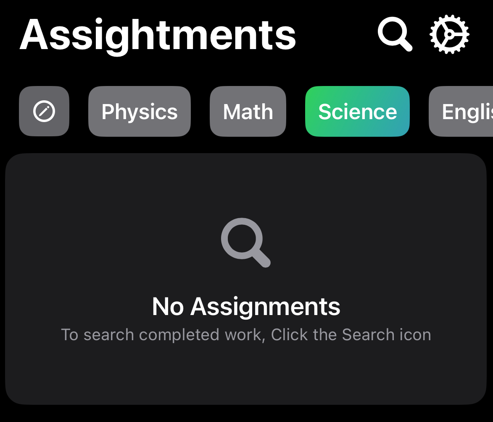
   
  
<em>A modern, intuitive assignment tracking app for iOS</em>

## 📱 Overview

DueBy is a powerful assignment tracking application built specifically for iOS 17.0+, leveraging the latest Apple technologies. It helps students manage their academic workload with an intuitive interface and smart organization features.

### ✨ Key Features

- 📊 Smart assignment categorization (Today, Upcoming, Overdue)
- 🎨 Customizable class colors and organization
- 🔔 Built-in notification system
- 🔍 Powerful search and filtering
- 📱 Native iOS design patterns
- 💾 Persistent data storage with SwiftData

## 🛠 Technical Details

- **Platform**: iOS 17.0+
- **Framework**: SwiftUI
- **Data Storage**: SwiftData
- **Dependencies**: None (100% Native)

## 📸 App Showcase

Click to view screenshots

### Home Screen & Assignment Management

  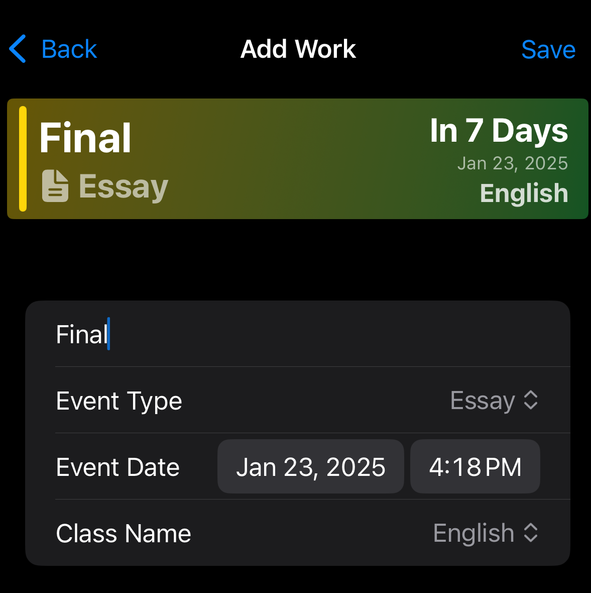
  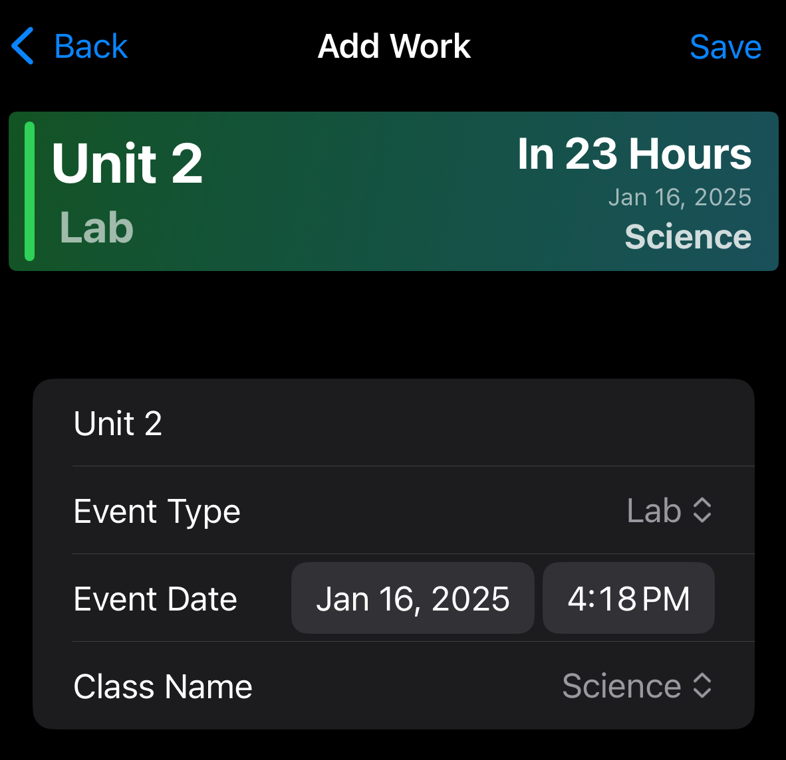
  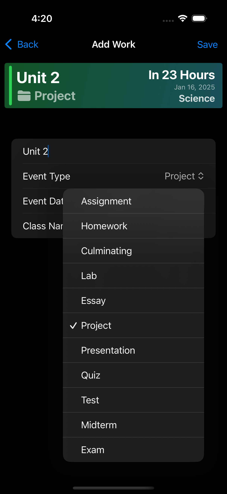

### Class Management & Settings

  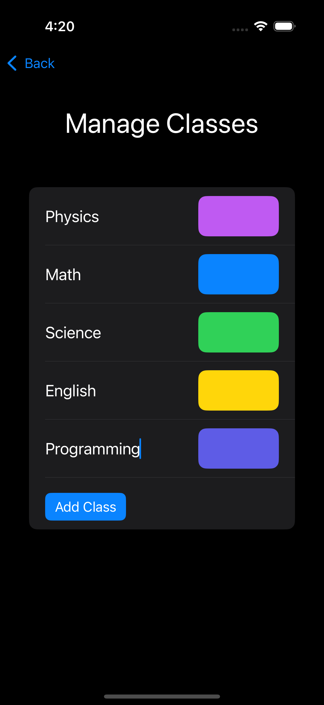
  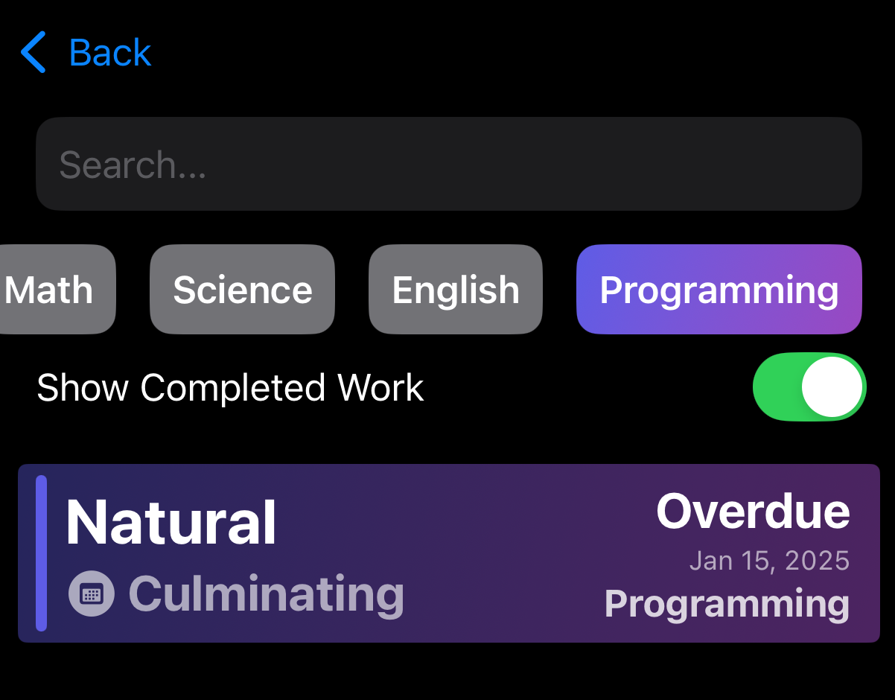
  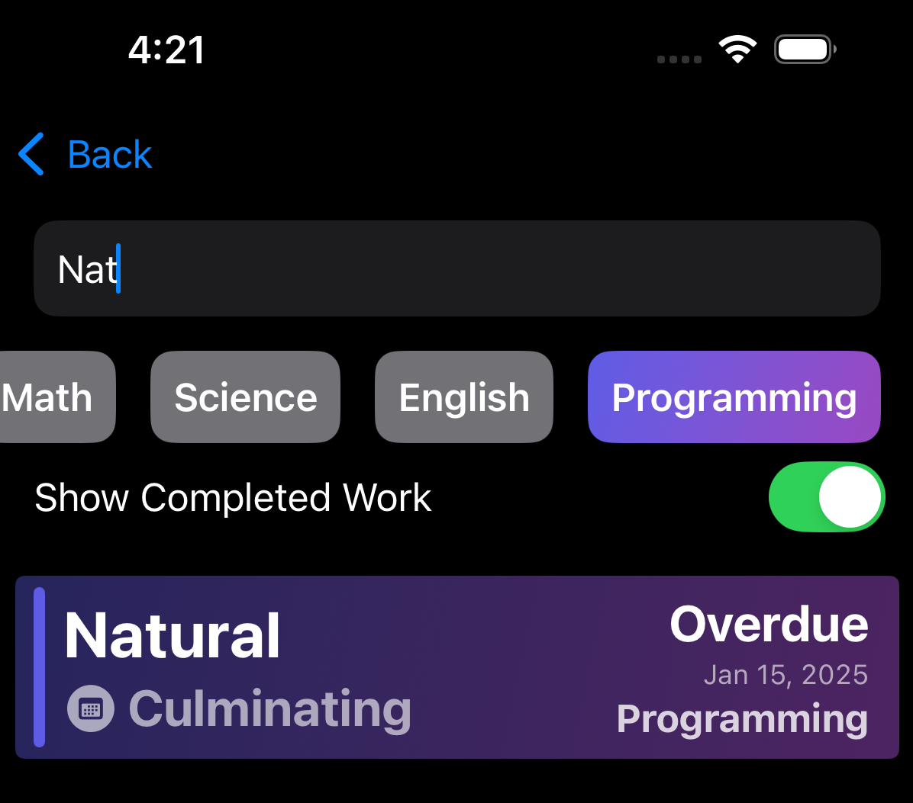

### Search & Organization

  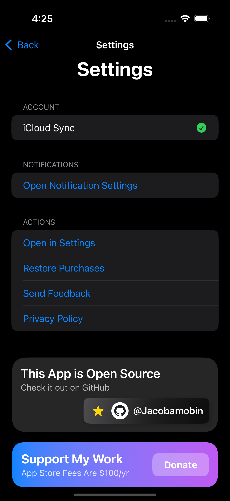
  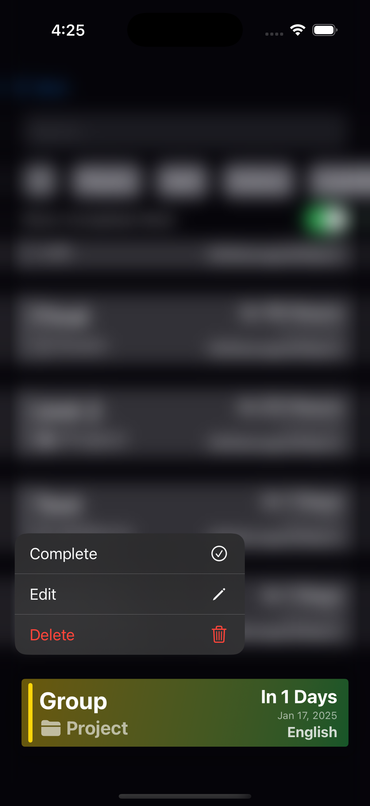
  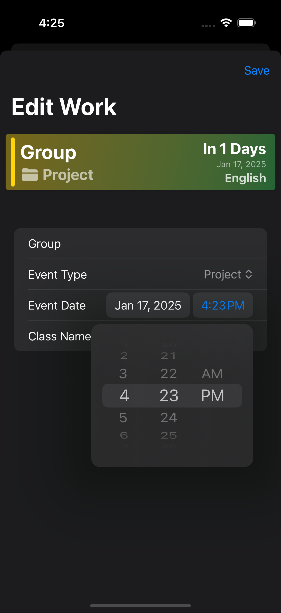

### Additional Features

  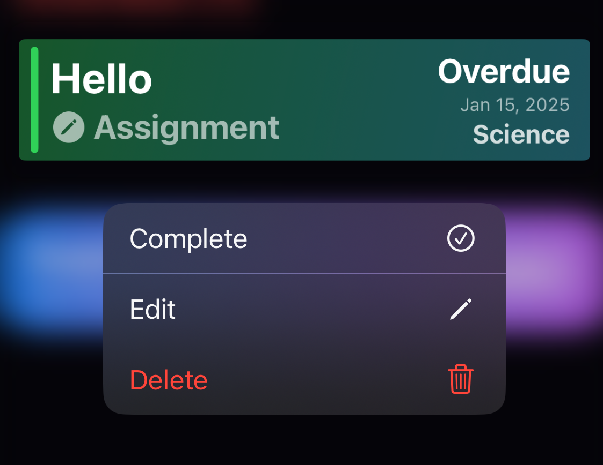

## ⚙️ Installation

1. Clone the repository
2. Open `DueBy.xcodeproj` in Xcode
3. Ensure you have Xcode 15.0+ and iOS 17.0+ SDK
4. Build and run on your device or simulator

## 🔒 Requirements

- iOS 17.0 or later
- Xcode 15.0 or later
- Swift 5.9 or later

## 🎯 Core Features

- **Smart Organization**: Automatically categorizes assignments by due date
- **Class Management**: Create and manage classes with custom colors
- **Assignment Tracking**: Add, edit, and mark assignments as complete
- **Search & Filter**: Find assignments quickly with powerful search capabilities
- **Notifications**: Get reminded of upcoming due dates
- **Data Persistence**: All data is stored locally using SwiftData

## 🤝 Contributing

Feel free to contribute to this project by:
1. Forking the repository
2. Creating a feature branch
3. Committing your changes
4. Opening a pull request

## 📝 Note

The "Support My Work" feature is currently implemented only for testing StoreKit integration and is not set up to accept actual donations.

## 📄 License

This project is licensed under the MIT License - see the LICENSE file for details.

---

  
Built with ❤️ using SwiftUI and SwiftData

